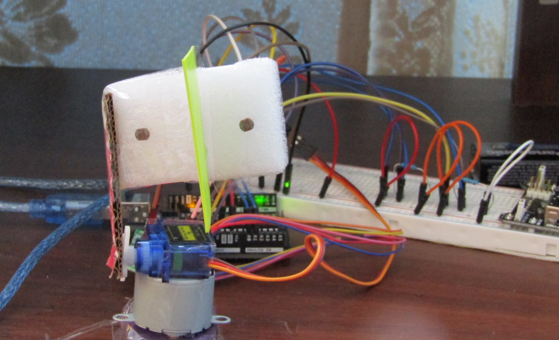

# light-tracker
> The program implements a light tracker with 2DOF (Degrees of Freedom). The circuit programs a stepper motor and servo motor. The stepper motor rotates the mechanism right and left along the azimuth while the servo motor rotates up and down along the altitude. The program uses two photoresistors and sets an algorithm to find the maximum light sensed while moving towards it.

## Table of contents
* [General info](#general-info)
* [Technologies](#technologies)
* [Circuit Setup](#circuit-setup)
* [Status](#status)
* [Video Link](#video-link)
* [Contact](#contact)

## General info
The purpose of this project is to explore the PID algorithm with the Atmega328 uController

## Technologies
* ArduinoIDE- version 1.8.13
* Arduino PID Library- version 1.2.0 - by [Brett Beauregard ](https://github.com/br3ttb/Arduino-PID-Library)

## Circuit Setup

> Mechanical & Electrical Set Up

## Status
Project is: _finished_

## Video Link
https://youtu.be/08LiVHFQBXw

## Contact
Created by [@akansha-n888](https://www.linkedin.com/in/akansha-nagar/) - feel free to contact me!
